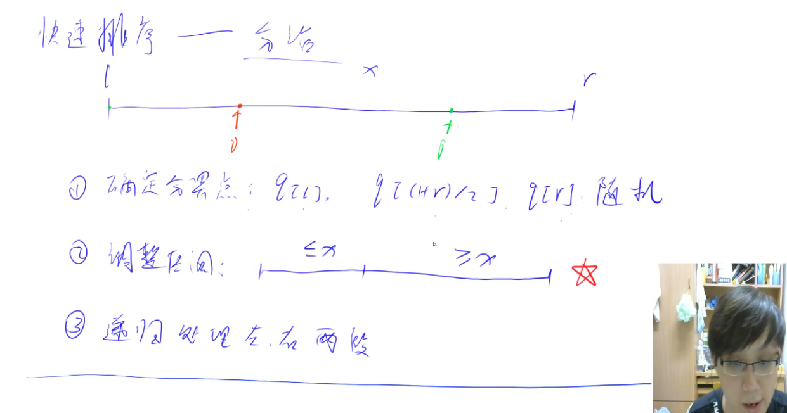
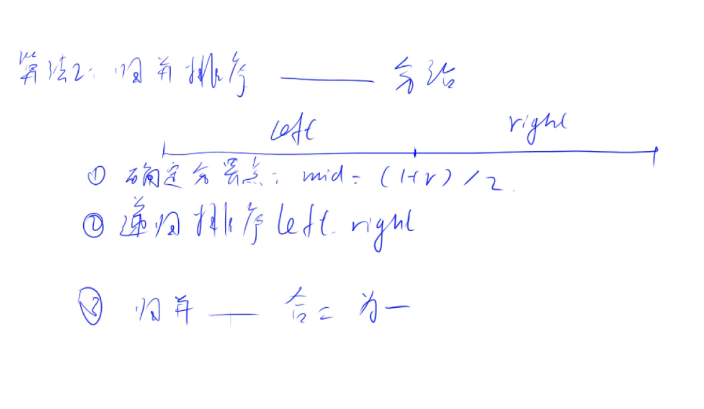

## 算法基础课

### 第一讲 基础算法

#### 快速排序

##### 快速排序（模板）

```c++
#include <iostream>
#include <cstdio>
using namespace std;

const int N = 1e6 + 10;
int a[N];

void quickSort(int a[], int l, int r)
{
	//当数组中被拆分只有一个元素或者没有元素时递归停止
	if (l >= r) return;

	//确定分解的元素，那么这次排序走完，左半部分都<=分界点，右半部分都>=分界点
	int t = a[l+r>>1], i = l - 1, j = r + 1;
    
	//每一次移动交换迭代
	while (i < j) 
	{
		do i++; while (a[i] < t);
		do j--; while (a[j] > t);
		if (i < j) swap(a[i], a[j]);
	}

	//递归排左右两边
	quickSort(a, l, j);
	quickSort(a, j + 1, r);

}

int main() 
{
	int n;
	scanf_s("%d", &n);
	for (int i = 0; i < n; ++i) 
	{
		scanf_s("%d", &(a[i]));
	}
	quickSort(a, 0, n-1);

	for (int i = 0; i < n; ++i) 
	{
		printf("%d ", a[i]);
	}

	return 0;
}
```

- 时间复杂度：最好O(nlogN)，平均O(nlogN)，最坏O(n方)
- 方法步骤：分治思想
  - 确定分界点：可以取a[l]，a[(l+r)/2]，a[r]，随机，一般取a[l+r>>1]就好
  - 调整区间：使每一次排序后左半部分都<=分界点，使每一次排序后右半部分都>=分界点，也即每一次j位置后面的元素都大于等于分界点，每一次i前面的元素都小于等于分界点
  - 递归处理左右两边：注意边界和上面取得分界点对应



##### 第K个数（快速选择）

```c++
#include <iostream>

using namespace std;

const int N = 1e5+10;
int a[N];

int quickChoice(int l, int r, int k)
{
    //第k个数一定在l-r这个区间，如果区间只有一个数，那么一定是k
    if(l == r) return a[l];
    
    //选择排序
    int mid = a[l+r>>1], i = l - 1, j = r + 1;
    while(i < j)
    {
        while(a[++i] < mid);
        while(a[--j] > mid);
        if(i < j) swap(a[i], a[j]);
    }
    
    //找满足条件的区间，使得快速排序只用递归排一边，所以时间复杂度为O(N)
    int sl = j-l+1;
    if(sl>=k)//第k个数在左边，那么递归左边
    {
        return quickChoice(l, j, k);
    }
    else//第k个数在右边，那么递归右边，则位置变为k-sl
    {
        return quickChoice(j+1, r, k-sl);
    }
}

int main()
{
    int n, k;
    cin >> n >> k;
    for(int i = 0; i < n; ++i)
    {
        cin >> a[i];
    }
    cout << quickChoice(0, n-1, k);
    
    return 0;
}
```

- 时间复杂度：O(N)，因为每一次只用递归一半的区间
- 快速排序，用第一次划分来理解递归，归并排序用最后一次合并来理解递归

#### 归并排序

##### 归并排序（模板）

```c++
#include <iostream>
#include <cstdio>

using namespace std;

const int N = 1e6 + 10;
int a[N];
int temp[N];

void mergeSort(int a[], int l, int r)
{
	//当数组中被划分的只有一个元素时，结束向下递归
	if (l >= r) return;

	//确定分解点为数组的中点位置
	int mid = l + r >> 1;

	//递归排左右两边
	mergeSort(a, l, mid);
	mergeSort(a, mid+1, r);

	//归并左右两部分，使这次递归排序，整体有序
	int k = 0, i = l, j = mid + 1;
	while (i <= mid && j <= r) 
	{
		if (a[i] <= a[j]) 
		{
			temp[k++] = a[i++];
		}
		else 
		{
			temp[k++] = a[j++];
		}
	}

	//当左半部分有剩余时，把剩余元素直接拷到替代数组中
	while (i <= mid) 
	{
		temp[k++] = a[i++];
	}
	//当右半部分有剩余时，把剩余元素直接拷到替代数组中
	while (j <= r) 
	{
		temp[k++] = a[j++];
	}

	//把替代数值中的元素拷回原数组
	for (int i = l, j = 0; i <= r; i++, j++) 
	{
		a[i] = temp[j];
	}
}

int main() 
{
	int n;
	scanf_s("%d", &n);

	for (int i = 0; i < n; ++i) 
	{
		scanf_s("%d", &a[i]);
	}

	mergeSort(a, 0, n-1);

	for (int i = 0; i < n; ++i) 
	{
		printf("%d ", a[i]);
	}


	return 0;
}
```

- 时间复杂度：标准的O(nlogN)
- 方法步骤：分治思想+N个辅助空间
  - 确定分界点：就是每一次区间长度的一半mid=l+r>>1
  - 递归排左右两边：这个和快排不一样，这个时先递归
  - 归并：这个就按照最后一次思考就行了，就是把两个都有序的两部分，合并成一个有序的序列



##### 逆序对的数量

```c++
#include <iostream>
#include <cstdio>
using namespace std;

typedef long long LL;
const int N = 1e5 + 10;
int a[N];
int temp[N];
LL res;

LL mergeSort(int l, int r)
{
    if (l >= r) return 0;

    int mid = l + r >> 1;
    res = mergeSort(l, mid) + mergeSort(mid + 1, r);

    int k = 0, i = l, j = mid + 1;
    while (i <= mid && j <= r) 
    {
        if (a[i] <= a[j])
        {
            temp[k++] = a[i++];
        }
        else
        {
            temp[k++] = a[j++];
            res += mid - i + 1;
        }
    }
    while (i <= mid)
    {
        temp[k++] = a[i++];
    }
    while (j <= r)
    {
        temp[k++] = a[j++];
    }

    for (int i = l, j = 0; i <= r; ++i, ++j)
    {
        a[i] = temp[j];
    }
    return res;
}

int main()
{
    int n;
    scanf("%d", &n);

    for (int i = 0; i < n; ++i)
    {
        scanf("%d", &a[i]);
    }

    cout << mergeSort(0, n - 1);
}
```

- 时间复杂度：O(nlogN)，和归并排序一样，就是利用归并的排序操作进行求解
- 经验：当递归有返回值时，注意结束递归时返回啥，向下递归时返回啥

#### 二分

- **有单调性一定可以二分，但是二分也可以解决非单调性问题，二分不等于单调性**

##### 整数二分

```c++
#include <iostream>
#include <cstdio>

using namespace std;

const int N = 1e5 + 10;
int a[N];

int main() 
{
	int n, q, num;
	scanf("%d%d", &n,&q);
	for (int i = 0; i < n; ++i) 
	{
		scanf("%d", &a[i]);
	}

	while (q--)
	{
		scanf("%d", &num);
        //第一种模板
		int l = 0, r = n - 1;
		while (l < r)
		{
			int mid = l + r >> 1;
			if (a[mid] >= num)
			{
				r = mid;
			}
			else
			{
				l = mid + 1;
			}
		}
		if (a[l] == num) 
		{
			printf("%d ",l);
            //第二种模板
			int l = 0, r = n - 1;
			while (l < r) 
			{
				int mid = l + r + 1 >> 1;
				if (a[mid] <= num) 
				{
					l = mid;//l=mid时,mid要加1
				}
				else 
				{
					r = mid - 1;
				}
			}
			printf("%d\n", l);
		}
		else 
		{
			printf("-1 -1\n");
		}

	}

	return 0;
}
```

- 时间复杂度：O(logN)，每一次都把区间折半

- 整数二分方法步骤：通过不断对半缩小区间找到答案

  - 确定是否是有序问题，否则无法二分

  - 定义左右区间，使得答案一定在这个区间范围内
  - 找到一种性质把区间划分为两部分，答案在左右区间的端点
  - 思考答案落在哪里，确定模板，书写check函数，对应mid是否加一

##### 实数二分

```c++
#include <iostream>
#include <cstdio>
using namespace std;

int main() 
{
	double num;
	cin >> num;
	//Pay attention to the range of the answers
	double l = -10000, r = 10000;
	while (r - l > 1e-8) 
	{
		double mid = (l + r) / 2;
		if (mid * mid * mid >= num) 
		{
			r = mid;
		}
		else 
		{
			l = mid;
		}
	}
	printf("%.6lf", r);
	return 0;
}
```

- 实数二分：不用特意考虑区间改变，直接取一半就好了，还要注意答案所在的范围

#### 高精度

- 这里主要解决大整数问题

##### 高精度加法

```c++
#include <iostream>
#include <cstdio>
#include <string>
#include <vector>
using namespace std;

//原始板子
/*vector<int> myAdd(vector<int>& A, vector<int>& B) 
{
	vector<int> C;
	int t = 0;//开始进位为0

	//把最长的读完为止
	for (int i = 0; i < A.size() || i < B.size(); ++i)
	{
		if (i < A.size()) t += A[i];
		if (i < B.size()) t += B[i];
		//本次的结果为本次对应的位加上上次的进位
		C.push_back(t % 10);
		t /= 10;
	}
	if (t) C.push_back(1);
	return C;
}*/

//最后写法
vector<int> myAdd(vector<int>& A, vector<int>& B)
{
    if(A.size() < B.size()) return myAdd(B, A);
    int t = 0;
    vector<int> C;
    for(int i = 0; i < A.size(); ++i)
    {
        t+=A[i];
        if(i < B.size()) t+=B[i];
        C.push_back( t % 10 );
        t /= 10;
    }
    if(t) C.push_back(1);
    return C;
}

int main() 
{
	string a, b;
	vector<int> A, B, C;
	cin >> a >> b;
	//倒叙存储，数组的第一个位置存大数的个位
	for (int i = a.size() - 1; i >= 0; --i) 
	{
		A.push_back(a[i] - '0');
	}
	for (int i = b.size() - 1; i >= 0; --i) 
	{
		B.push_back(b[i] - '0');
	}
	C = myAdd(A, B);
	for (int i = C.size() - 1; i >= 0; --i) 
	{
		cout << C[i];
	}


	return 0;
}
```

- 思想：利用数组来存储数字，一位位的模拟加法操作，并把结果存到数组中输出

##### 高精度减法

```c++
#include <iostream>
#include <string>
#include <vector>

using namespace std;

//判断A是否大于等于B
bool cmp(vector<int>& A, vector<int>& B)
{
	if (A.size() != B.size()) return A.size() > B.size();
	for (int i = A.size() - 1; i >= 0; --i)
	{
		if (A[i] != B[i])
		{
			return A[i] > B[i];
		}
	}
	return true;
}

//C=A-B 需A>=B A>=0 B>=0
vector<int> sub(vector<int>& A, vector<int>& B)
{
	vector<int> C;
	//t表示开始的借位0
	for (int i = 0, t = 0; i < A.size(); ++i)
	{
		t = A[i] - t;
		if (i < B.size())
		{
			t -= B[i];
		}
		C.push_back((t + 10) % 10);
		if (t < 0) t = 1;
		else t = 0;
	}
	//把多余的前缀零删除
	while (C.size() > 1 && C.back() == 0) C.pop_back();
	return C;
}


int main()
{
	string a, b;
	vector<int> A, B, C;
	cin >> a >> b;
	for (int i = a.size() - 1; i >= 0; --i) A.push_back(a[i] - '0');
	for (int i = b.size() - 1; i >= 0; --i) B.push_back(b[i] - '0');

	//保证相减的数都是大整数-小整数的形式
	if (cmp(A, B))
	{
		C = sub(A, B);
		for (int i = C.size() - 1; i >= 0; --i) cout << C[i];
	}
	else//-(B-A)
	{
		C = sub(B, A);
		cout << "-";
		for (int i = C.size() - 1; i >= 0; --i) cout << C[i];
	}


	return 0;
}
```

- 该模板只能计算大正整数-大正整数的情况，涉及负数时需要结合逻辑具体书写

##### 高精度乘法

```c++
#include <iostream>
#include <string>
#include <vector>

using namespace std;

vector<int> mul(vector<int>& A, int b)
{
	vector<int> C;
	int t = 0;//进位:表示上一次的进位
	for (int i = 0; i < A.size() || t; ++i)
	{
		if (i < A.size())
		{
			t += A[i] * b;
		}
		C.push_back(t % 10);
		t /= 10;
	}
	while (C.size() > 1 && C.back() == 0) C.pop_back();
	return C;
}

int main()
{
	string a;
	int b;
	vector<int> A, C;
	cin >> a >> b;
	for (int i = a.size() - 1; i >= 0; --i) A.push_back(a[i] - '0');
	C = mul(A, b);
	for (int i = C.size() - 1; i >= 0; --i) cout << C[i];


	return 0;
}
```

- 改模板主要计算一个大整数乘以一个小整数
- 思路：把小整数看成一个整体，用大整数一位位的求解

##### 高精度除法

```c++
#include <iostream>
#include <vector>
#include <string>
#include <algorithm>
using namespace std;

vector<int> div(vector<int>& A, int b, int& r) 
{
	vector<int> C;
	r = 0;//余数
	for (int i = A.size() - 1; i >= 0; --i)//从高位开始算 
	{
		r = r * 10 + A[i];
		C.push_back(r / b);
		r %= b;
	}
	reverse(C.begin(), C.end());
	while (C.size() > 1 && C.back() == 0) C.pop_back();//去掉前导零
	return C;
}

int main() 
{
	string a;
	int b, r;//b是除数，r是余数
	vector<int> A, C;
	cin >> a >> b;
	for (int i = a.size() - 1; i >= 0; --i) A.push_back(a[i] - '0');
	C = div(A, b, r);
	for (int i = C.size() - 1; i >= 0; --i) cout << C[i];
	cout << endl << r;

	return 0;
}
```

- 改模板主要计算一个大整数除以一个小整数

##### 高精度总结

- 高精度数都是用数组低位存高进度数的低位
- 四个计算模板都不设计负数，如果涉及负数可以根据逻辑转换计算
- 减法和加法为大整数和大整数的运算，乘法和除法为大整数和小整数的计算

#### 前缀和和差分

##### 一维前缀和

```c++
#include <iostream>
using namespace std;

const int N = 100010;
int a[N];//原数组
int s[N];//前缀和数组

int main() 
{
	int n, m;
	scanf("%d%d", &n, &m);
	for (int i = 1; i <= n; ++i) 
	{
		scanf("%d", &a[i]);
		s[i] = s[i - 1] + a[i];//前缀和数组的求解
	}
	while (m--) 
	{
		int l, r;
		scanf("%d%d", &l, &r);
		printf("%d\n", s[r] - s[l - 1]);//前缀和数组的使用
	}

	return 0;
}
```

- 一维前缀和的作用：用O(1)的时间复杂度求出静态数组某一段区间的元素的和
- 技巧：数组下标从1开始使用

##### 子矩阵的和

```c++
#include <iostream>
using namespace std;

const int N = 1010;
int a[N][N];
int s[N][N];

int main()
{
	int n, m, q;
	cin >> n >> m >> q;
	for (int i = 1; i <= n; ++i)
	{
		for (int j = 1; j <= m; ++j)
		{
			cin >> a[i][j];
			s[i][j] = s[i - 1][j] + s[i][j - 1] - s[i - 1][j - 1] + a[i][j];//求前缀和
		}
	}

	while (q--)
	{
		int x1, y1, x2, y2;
		cin >> x1 >> y1 >> x2 >> y2;
		cout << s[x2][y2] - s[x1 - 1][y2] - s[x2][y1 - 1] + s[x1 - 1][y1 - 1] << endl;//求子矩阵的和
	}

	return 0;
}
```

- 二维前缀和的作用：用O(1)的时间复杂度求出静态二维数组某一段区间的元素的和
- 关键在于前缀和求解的公式和前缀和的使用公式（容斥原理）

##### 一维差分

```c++
#include <iostream>

using namespace std;
const int N = 100010;
int a[N];//原数组（原数组是差分数组的前缀和）
int b[N];//差分数组

void insert(int l, int r, int c)
{
	b[l] += c;
	b[r + 1] -= c;
}

int main()
{
	int n, m;
	scanf("%d%d", &n, &m);
	for (int i = 1; i <= n; ++i)
	{
		scanf("%d", &a[i]);
		insert(i, i, a[i]);//构造差分数组
	}

	while (m--)
	{
		int l, r, c;
		scanf("%d%d%d", &l, &r, &c);
		insert(l, r, c);
	}
	for (int i = 1; i <= n; ++i)
	{
		b[i] += b[i - 1];//利用差分数组求原数组
		printf("%d ", b[i]);
	}

	return 0;
}
```

- 作用：在O(n)的预处理后，以O(1)的时间复杂度给静态数组某一段加上一个固定的值
- 关键：理解insert函数对最初差分数组的构造

##### 差分矩阵

```c++
#include <iostream>

using namespace std;
const int N = 1010;
int a[N][N];//原矩阵（差分矩阵的前缀和）
int b[N][N];//差分矩阵

void insert(int x1, int y1, int x2, int y2, int c)
{
	b[x1][y1] += c;
	b[x1][y2 + 1] -= c;
	b[x2 + 1][y1] -= c;
	b[x2 + 1][y2 + 1] += c;
}

int main()
{
	int n, m, q;
	cin >> n >> m >> q;
	for (int i = 1; i <= n; ++i)
	{
		for (int j = 1; j <= m; ++j)
		{
			cin >> a[i][j];
			insert(i, j, i, j, a[i][j]);//求差分数组
		}
	}

	while (q--)
	{
		int x1, y1, x2, y2, c;
		cin >> x1 >> y1 >> x2 >> y2 >> c;
		insert(x1, y1, x2, y2, c);
	}

	for (int i = 1; i <= n; ++i)
	{
		for (int j = 1; j <= m; ++j)
		{
			b[i][j] += b[i - 1][j] + b[i][j - 1] - b[i - 1][j - 1];//利用差分数组求前缀和
			cout << b[i][j] << " ";
		}
		cout << endl;
	}

	return 0;
}
```

- 作用：在O(n方)的预处理后，以O(1)的时间复杂度给静态二维数组某一段加上一个固定的值
- 关键：结合一维差分理解insert函数

##### 前缀和和差分总结

- 前缀和和差分可以看成一对互逆的运算
- 前缀和的作用是在预处理完，用O(1)的时间复杂度求出静态数组某一段的和
- 差分的作用是在预处理完，用O(1)的时间复杂度为静态数组某一段加上某一个固定的数
- 前缀和和差分数组都从1开始使用

#### 双指针算法

- 类型：

  - 类型一：两个指针各个维护着一段序列
  - 类型二：两个指针共同维护这一段序列

- 形式

  ```c++
  	for (int i = 0, j = 0; i < n; ++i) 
  	{
  		while (i < j && check(i, j)) 
  		{
  			++j;
  		}
  		//具体的代码逻辑
  	}
  ```

- 作用：把两层循环的枚举O(n方)的时间复杂度利用某种性质（单调性质）优化到O(n)的时间复杂度

##### 单词分割

```c++
#include <iostream>
#include <cstdio>
#include <cstring>
using namespace std;

int main() 
{
	char str[110];
	cin.getline(str, 100);
	int n = strlen(str);
	for (int i = 0; i < n; ++i) 
	{
		int j = i;//保证每一次i都是单词的开头
		while (j < n && str[j] != ' ')
		{
			j++;
		}
		for (int k = i; k < j; ++k) 
		{
			cout << str[k];
		}
		cout << endl;
		i = j;//i每一次先指向空格的位置，然后在++
	}

	return 0;
}
```

- 时间复杂度O(n)，看似是两层循环，但是i，j都只会走各自的一趟，不是组合关系
- 补充：高版本c为了安全性禁掉了gets，因为他不会检测缓冲区，会造成溢出（了解）

##### 最长连续不重复子序列

```c++
#include <iostream>
using namespace std;

const int N = 100010;
int a[N];//原数组
int s[N];//计数数组

int main() 
{
	int n;
	cin >> n;
	for (int i = 0; i < n; ++i) 
	{
		cin >> a[i];
	}
	int res = 0;
    //枚举右端点
	for (int i = 0,j=0; i < n; ++i) 
	{
		s[a[i]]++;
        //当区间有重复元素时j后移
		while (s[a[i]] > 1) 
		{
			s[a[j]]--;
			j++;
		}
		res = max(res, i - j + 1);
	}
	cout << res;

	return 0;
}
```

- 补充：当数据较小时利用数组来判重，数组的下标的范围为所给值的范围

##### unique函数的实现

```c++
vector<int>::iterator unique( vector<int>& v) 
{
	int j = 0;
	for (int i = 0; i < v.size(); ++i) 
	{
		if (!v[i] || v[i - 1] != v[i]) 
		{
			v[j++] = v[i];
		}
	}
	return v.begin() + j;//返回不重复元素的下一个位置
}
```

- unique函数的作用：排序后返回不重复元素的下一个位置的迭代器
- 排序后，如果这个元素是第一个或者后一个元素和前一个元素不同，那么这个元素一定不重复，则保存下来

##### 双指针算法总结

- 双指针的关键在于找到单调性质使得二重循环组合的枚举退化成最多枚举2n次

#### 位运算

- 这里主要针对于正整数

##### 二进制表示

```c++
#include <iostream>
using namespace std;

int main() 
{
	int num;
	cin >> num;
	for (int k = 4; k >= 0; --k) 
	{
		cout << (num >> k & 1) << " ";
	}

	return 0;
}
```

- num>>k&1可以将这个正整数按照二进制展开

##### 二进制中1的个数

```c++
#include <iostream>
using namespace std;

//lowbit可以返回整数中最后一个1
int lowbit(int x) 
{
	return x & -x;
}

int main() 
{
	int n;
	cin >> n;
	while (n--) 
	{
		int x;
		cin >> x;
		int res = 0;
		while (x) 
		{
            //每一次把最后的1减掉
			x -= lowbit(x);
			++res;
		}
		cout << res << ' ';
	}


	return 0;
}
```

- lowbit函数的作用：返回正整数用二进制表示时最后一个1对应的十进制数值
- lowbit函数还可以间接统计正整数中用二进制表示1的个数

#### 离散化

- 这里特指有序的整数的离散化

##### 区间求和

```c++
#include <iostream>
#include <vector>
#include <algorithm>

using namespace std;

typedef pair<int, int> PII;
const int N = 300010;
int a[N];           //离散化后前缀和原数组
int s[N];           //离散化后前缀和数组
vector<PII> add;    //添加元素操作
vector<PII> query;  //询问操作
vector<int> alls;   //离散化后的下标

int find(int x)     //二分离散化后的坐标（映射坐标）
{
	int l = 0, r = alls.size() - 1;
	while (l < r) 
	{
		int mid = l + r >> 1;
		if (alls[mid] >= x) 
		{
			r = mid;
		}
		else 
		{
			l = mid + 1;
		}
	}
	return l + 1;
}

int main() 
{
	int n, m;
	cin >> n >> m;
	for (int i = 0; i < n; ++i) 
	{
		int x, c;
		cin >> x >> c;
		add.push_back({ x,c });
		alls.push_back(x);
	}

	for (int i = 0; i < m; ++i) 
	{
		int l, r;
		cin >> l >> r;
		query.push_back({ l,r });
		alls.push_back(l);
		alls.push_back(r);
	}
	//排序
	sort(alls.begin(), alls.end());
	//去重
	alls.erase(unique(alls.begin(), alls.end()), alls.end());

	//处理添加操作
	for (auto item : add) //时间复杂度O(n*log(n))
	{
		int x = find(item.first);
		a[x] += item.second;
	}
	//预处理前缀和
	for (int i = 1; i <= alls.size(); ++i) 
	{
		s[i] = s[i - 1] + a[i];
	}
    //利用前缀和求解
	for (auto item : query) 
	{
		int l = find(item.first);
		int r = find(item.second);
		cout << s[r] - s[l - 1] << endl;
	}

	return 0;
}
```

- 应用场景：当值域很大，但是我们只用到值域里面间隔很大的一小部分数时考虑用离散化映射坐标后求解
- 离散化的本质，是映射，将间隔很大的点，映射到相邻的数组元素中，减少对空间的需求，也减少计算量
- 补充：unique函数的使用要在排序后，否则无效

#### 区间合并

##### 区间合并

```c++
#include <iostream>
#include <vector>
#include <algorithm>

using namespace std;

typedef pair<int, int> PII;
vector<PII> segs;

void merge(vector<PII>& segs)
{
	vector<PII> res;
	//对对组按照第一个数，排序，那么区间有没有交集只需要比较区间的右端点

	sort(segs.begin(), segs.end());
	//开始的第一个区间置为最小，主要是为了更新我们输入的第一个区间，为第一个区间
	int start = -2e9, end = -2e9;
	for (auto item : segs)
	{
		//当前区间和下一个要比较的区间没有交集
		if (end < item.first)
		{
			if (start != -2e9)//防止初始化的区间被推入
			{
				res.push_back({ start,end });
			}
			//更新当前区间为下一个区间
			start = item.first;
			end = item.second;

		}
		//当前区间和下一个区间有交集更新区间为两者的并集
		else
		{
			end = max(end, item.second);
		}
	}
	//防止n等于0时，推进不合法区间
	if (start != -2e9)
	{
		//保证最后一个区间被推进
		res.push_back({ start,end });
	}

	segs = res;
}

int main()
{
	int n;
	cin >> n;
	for (int i = 0; i < n; ++i)
	{
		int l, r;
		cin >> l >> r;
		segs.push_back({ l, r });
	}
	merge(segs);
	cout << segs.size();

	return 0;
}
```

- 思想：排序后只需要比较区间右端点分三种情况讨论区间更新
- 时间复杂度：主要取决于sort函数，大概为O(log(n))
- 作用：能找出众多区间中有交集的个数，并且能输出每一个合并后的区间

### 第二讲 数据结构

链表：这里为了速度，用数组来模拟链表，也即静态链表

- 单链表：单链表为了写邻接表，邻接表是为了存储树和图（单链表只能往后走）
- 双链表：为了优化某些问题

#### 单链表

```c++
#include <iostream>

using namespace std;

const int N = 100010;

int head;//链表头节点
int e[N];//存放下标为i的值
int ne[N];//存放下标为i的下一该位置的下标
int idx;//下一个待插入元素的位置

void init() 
{
    head = -1;
    idx = 0;
}

//插入头节点
void insertToHead(int x) 
{
    e[idx] = x;
    ne[idx] = head;
    head = idx;
    idx++;
}

//在第k个下标后面插入一个x
void myInsert(int k, int x) 
{
    e[idx] = x;
    ne[idx] = ne[k];
    ne[k] = idx;
    idx++;
}

//删除第k个下标后面的元素
void del(int k) 
{

    ne[k] = ne[ne[k]];
}

int main() 
{
    init();
    int m, a, b;
    cin >> m;
    while (m--) 
    {
        char op;
        cin >> op;
        if (op == 'H')
        {
            cin >> a;
            insertToHead(a);
        }
        else if(op =='I')
        {
            cin >> a >> b;
            myInsert(a - 1, b);
        }
        else 
        {
            cin >> a;
            if (a == 0) 
            {
                head = ne[head];
            }
            del(a - 1);
        }
    }

    for (int i = head; i != -1; i = ne[i]) 
    {
        cout << e[i] << ' ';
    }

    return 0;
}
```

- 静态链表的插入操作，需要借助idx来完成，不如动态链表方便，但是由于预留了空间，所以速度比动态链表快
- idx下标的含义：表示待插入元素的下标
- 删除元素，只是不能访问到这个元素，只是将指针改变，并没有销毁该元素的空间
- 当删除，插入操作交叉执行时，那么数组的下标可能不连续，但是我们是通过ne[i]来遍历链表，不影响
- 注意插入操作的赋值顺序，不能交换


***


```c++
#include <iostream>
using namespace std;

int n, m;
int path[15];
bool st[15];

bool dfs(int u) 
{
	if (u == n) 
	{
		m--;
		if (!m) 
		{
			for (int i = 0; i < n; ++i) 
			{
				cout << path[i] << " ";
			}
			return true;
		}
		return false;
	}

	for (int i = 1; i <= n; ++i) 
	{
		if (!st[i]) 
		{
			path[u] = i;
			st[i] = true;
			if (dfs(u + 1)) return true;
			st[i] = false;
			
		}
	}
	return false;
}

int main() 
{
	cin >> n >> m;
	dfs(0);

	return 0;
}
```

